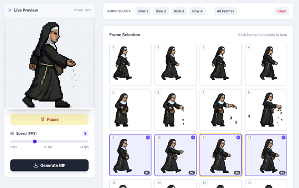

# Sprite Sheet Animator

A web-based tool for creating animated GIFs from sprite sheets. Upload your sprite sheet, select frames, adjust animation speed, and export as a GIF.



## Features

- Upload and automatically slice sprite sheets into individual frames
- Configurable grid dimensions (rows × columns)
- Visual frame selection with live preview
- Adjustable animation speed (1-24 FPS)
- Quick select options (by row or all frames)
- Export animations as downloadable GIFs
- Drag-and-drop file upload

## Getting Started

### Installation

```bash
npm install
```

### Development

```bash
npm run dev
```

### Build

```bash
npm run build
```

## Usage

1. Upload a sprite sheet image (JPG or PNG)
2. Adjust grid dimensions to match your sprite sheet
3. Click frames to select them for animation
4. Use quick select buttons to choose entire rows
5. Adjust FPS slider to control animation speed
6. Click "Generate GIF" to create your animation
7. Download the result

## Tech Stack

- React 18
- Vite
- Tailwind CSS
- gifshot (GIF generation)
- Lucide React (icons)

## Creating a Sprite With Nano Banana Pro

You can give as input a 4x4.png grid (available in the [image_examples](image_examples/) folder) for Nano Banana Pro to position the pixel art sprite images. You can try to get a transparent background, but I had to edit mine and fix a few things in an image editor.

---

## Credits

This project was initially coded in AI Studio by Gemini 3 Pro and then finished as a web app by Claude.
